# {{project_name.snakeCase()}}

{{project_name.titleCase()}} project.

## Getting Started

For help getting started with Flutter development, view the
[online documentation](https://docs.flutter.dev/), which offers tutorials,
samples, guidance on mobile development, and a full API reference.

## Recreate Flutter environment

The purpose of this section is to guide you in recreating the Flutter 
environment to be able to launch the Flutter project locally.

### IDEs installation

We need to install `Android Studio` in order to create virtual Android 
devices and launch the project in an Android emulator.

If you want you can also install `Visual Studio Code` which is a lighter 
IDE and consume less CPU and video resources than `Android Studio`.

#### Android Studio

Go to: https://developer.android.com/studio and download the 
`Android Studio` version according to your Operating System (**MacOS**, 
**Windows**, **Linux**).

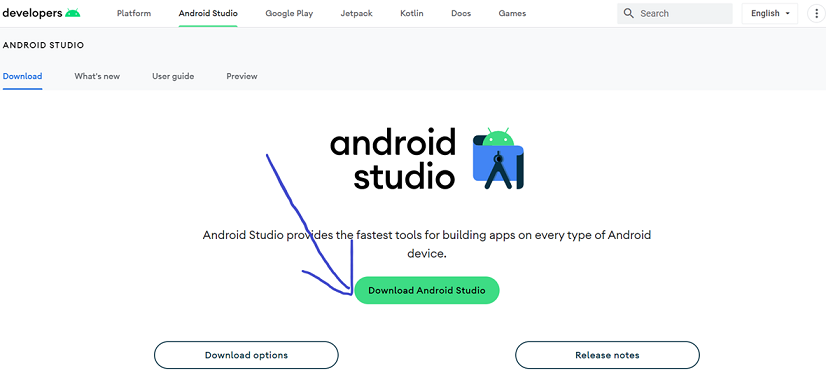

##### MacOS

1. Open the downloaded installation file with extension `.dmg`.

2. Move the `Android Studio` application to your `Applications` directory.

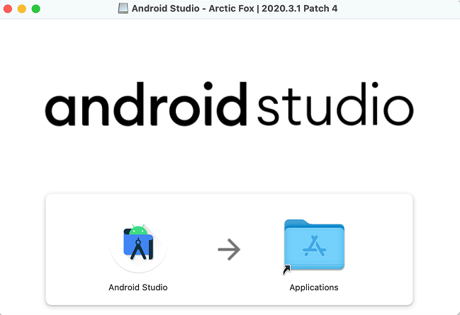

3. Open `Android Studio`

4. During the settings verification (`Verify Settings`) be sure to 
include `Android Emulator`, `Android SDK Build-Tools X`, 
and `Android SDK Platform X`; where `X` represents the version.

On OSX 13.1 upon opening Android Studio Electric Eel there is no
'Verify Settings' part of the Android Studio Setup. 

5. Click on the `Plugins` option from the left menu and select `Flutter` 
under the `Marketplace` tab.

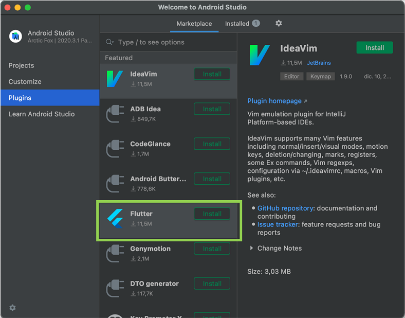

6. Click on `Install` to install the required plugins.

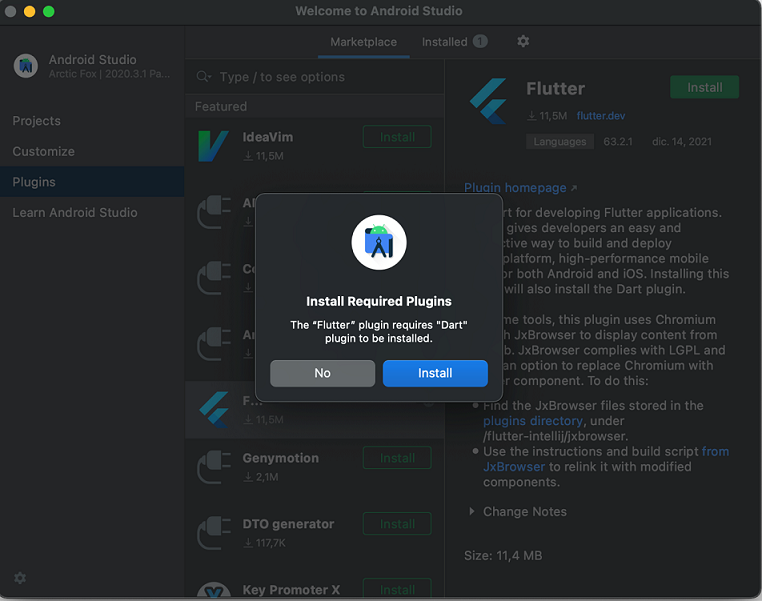

7. Restart the IDE to apply changes.

##### Windows
1. Open the installation file and install `Android Studio`

2. Click on the engine icon and select the `Settings` option

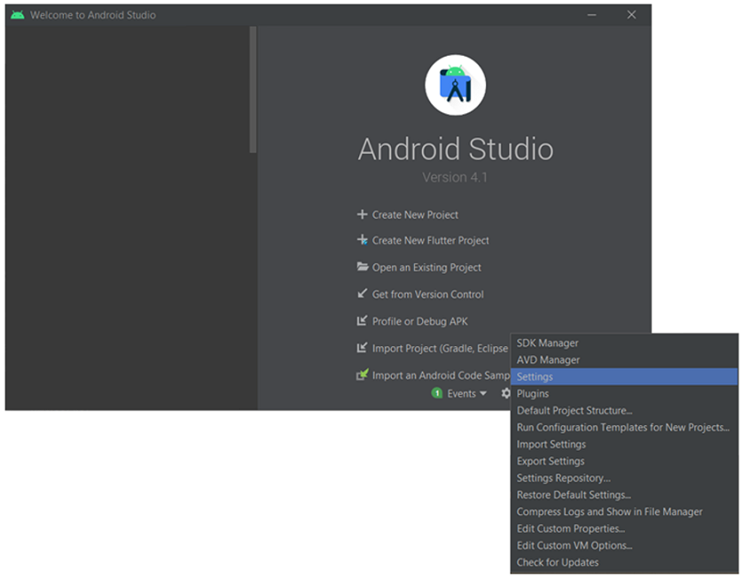

3. On the left menu select the `Plugins` option and then install 
the `Dart` and `Flutter` plugins under the `Marketplace` tab.

4. Restart the IDE to apply changes.

#### Visual Studio Code

1. Download the installer: https://code.visualstudio.com

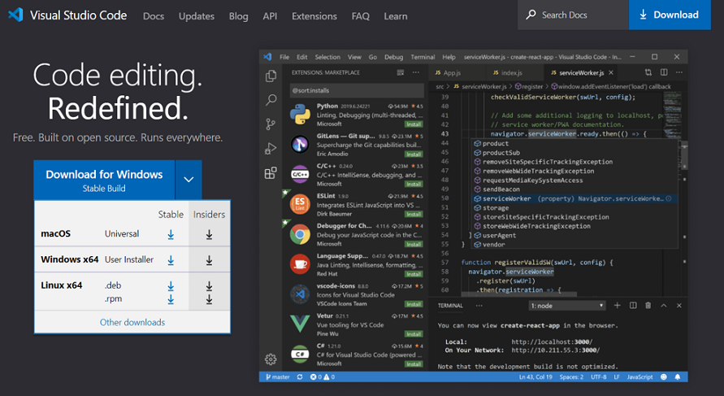

2. Open the IDE and from the left menu select the `Extensions` option.

3. Install the `Flutter` plugin.

### Flutter SDK installation

Every Operating System has its own installer and installation steps.

### MacOS

1. Download the Flutter SDK: https://docs.flutter.dev/get-started/install/macos

2. Do the following operations to unzip the installer:

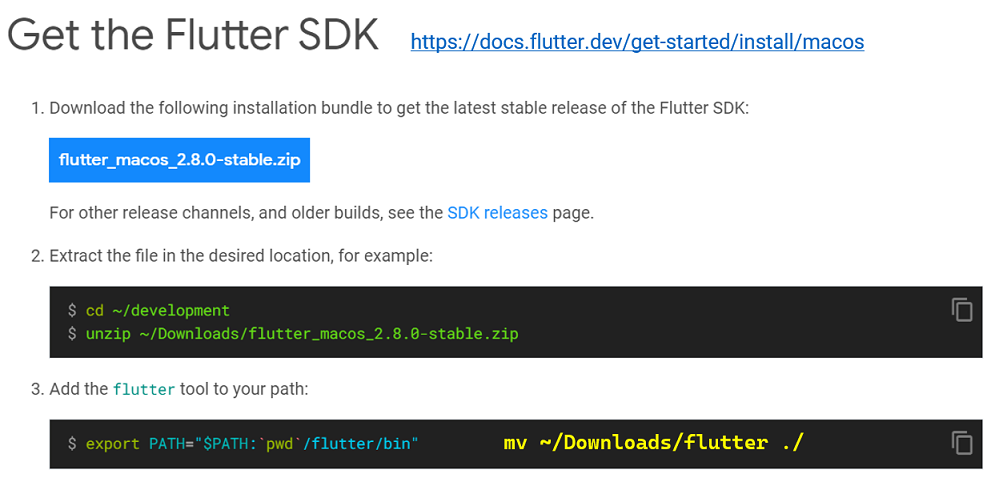

3. Update the path permanently to use the Flutter CLI directly from the
terminal:

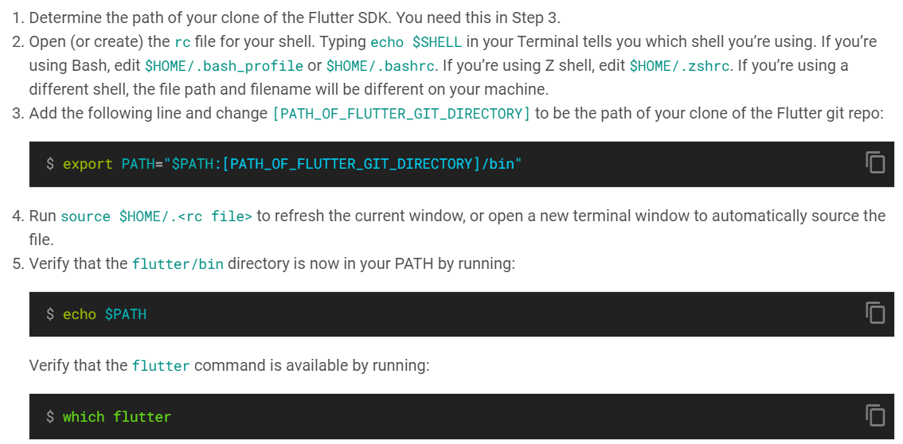

In some cases you need to do the following:

* `echo $SHELL`
    output: `/bin/zsh`
    
* `vi ~/.zshrc`
    output: `export PATH="$PATH:$HOME/development/flutter/bin"`
    
* `source ~/.zshrc`
    
* `flutter doctor`

4. If you find the warning `Android Studio (not installed)` after running the 
`flutter doctor` command...

... move the `Android Studio` application to your `Applications` directory.

5. If at some point you encounter the following error `The operation couldn't be completed. Unable to locate a Java Runtime..` do this:

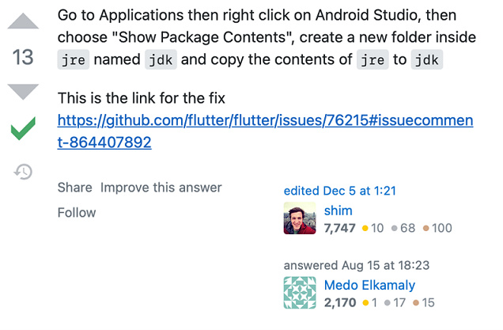

6. If you find the `cmdline-tools component is missing` error after running the 
`flutter doctor` command:

* Open Android Studio

* Click on `Android Studio` option on the right side of the Apple icon

* Select `Preferences`

* Under `Appearance & Behavior/System Settings/Android SDK -> SDK Tools` 
    install the `Android SDK Command-line Tools`

7. If you run the `flutter doctor` command again and notice that the appear a 
warning saying `Some Android licenses not accepted...`, run the following 
command: `flutter doctor --android-licenses`

If you run the above command and appear the following error: `A JNI error has occurred, please check your installation and try again Exception in thread "main" java.lang.UnsupportedClassVersionError: com/android/prefs/AndroidLocationsProvider has been compiled by a more recent version of the Java Runtime (class file version 55.0), this version of the Java Runtime only recognizes class file versions up to 52.0`,
try to downgrade your Java version from Android Studio:

* Navigate to `Android Studio > Settings > Appearance & Behavior > System Settings > Android SDK`

* Select `SDK Tools` and check `Show Package Details` option.

* Expand the `Android SDK Command-line Tools` option and select a previous
version (i.e., `Android SDK Command-line Tools 8.0`).

* Press `Apply` and the download of the selected version will start.

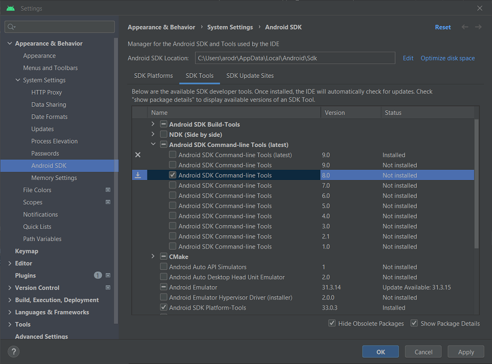

8. If you run the `flutter doctor` command again and notice that the appear a 
warning saying
`[!] Android Studio (version 2022.1) ✗ Unable to find bundled Java version.`,
run the following command: `cd /Applications/Android\ Studio.app/Contents` and
then `ln -s jbr jre`.

This is on latest Android Studio - Electric Eel version, note that the bundled
jre directory in the Android Studio installation folder is now renamed to jbr
according to: https://stackoverflow.com/questions/51281702/unable-to-find-bundled-java-version-on-flutter

### Windows

1. Download the Flutter SDK: https://docs.flutter.dev/get-started/install/windows

2. Update path permanently:

* Summary of actions from Flutter official doc

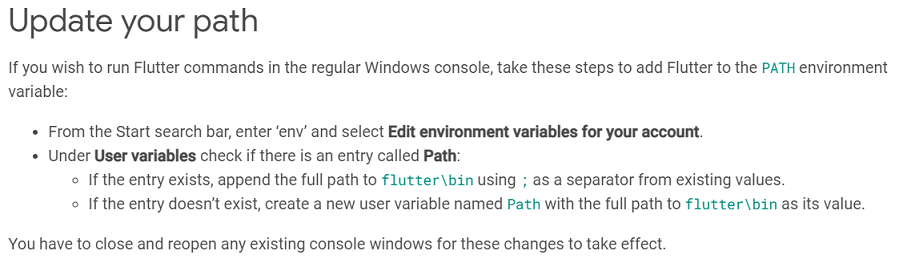

* Click on Windows icon, type `env`, and select `Edit the system environment variables` 

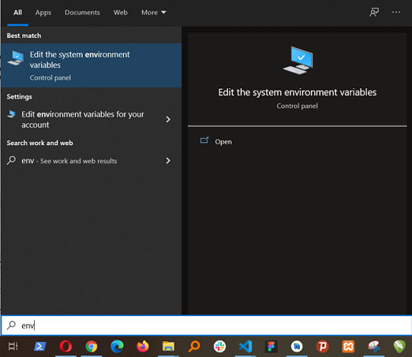

* Press `Environment variables...` button

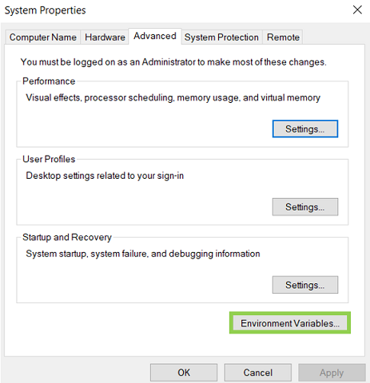

* On the `System variables` section select `Path` and click `Edit...`

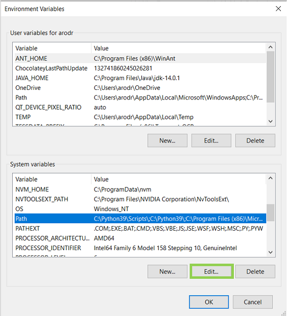

* Select `New...` and add the path to the Flutter SDK

### Create virtual device (Android)

1. Open `Android Studio`

2. Open the `AVD Manager` by clicking in the icon consisting in a phone and Andoid icon.
Then select the `Create Virtual Device` option.

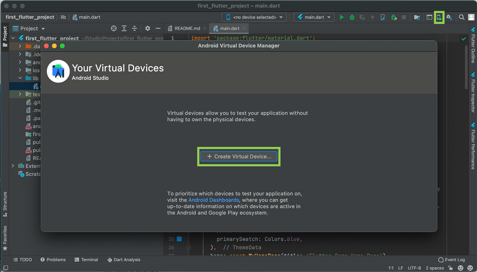

3. Select a device from the `Select Hardware` section.

4. Select an Android SDK from the `System Image` section to install it on the new device.

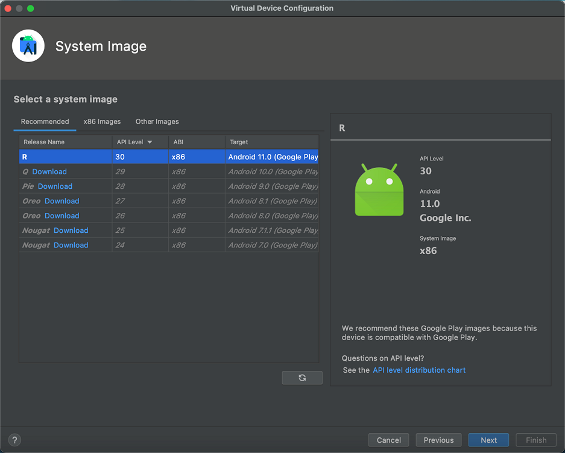

5. Give the device a name and select the default orientation.

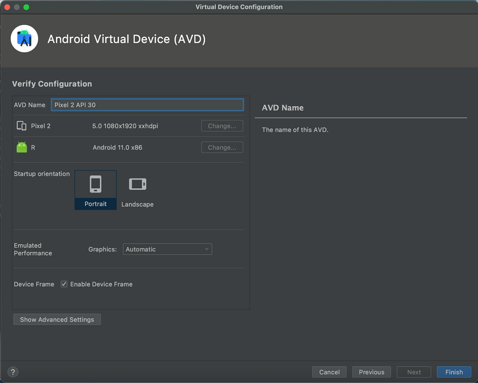

6. Press the play button to start the new device.

### Run project

1. Open `Android Studio`

2. Click on `File/Open` and select the project directory

3. Select a device and press the play button.

